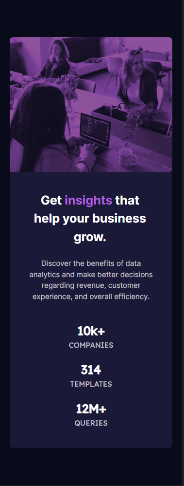

# Frontend Mentor - Stats preview card component solution

This is a solution to the [Stats preview card component challenge on Frontend Mentor](https://www.frontendmentor.io/challenges/stats-preview-card-component-8JqbgoU62). Frontend Mentor challenges help you improve your coding skills by building realistic projects. 

## Table of contents

- [Overview](#overview)
  - [The challenge](#the-challenge)
  - [Screenshot](#screenshot)
  - [Links](#links)
- [My process](#my-process)
  - [Built with](#built-with)
  - [What I learned](#what-i-learned)
  - [Useful resources](#useful-resources)
- [Author](#author)

## Overview

### The challenge

Users should be able to:

- View the optimal layout depending on their device's screen size

### Screenshot

### Links

- Solution URL: [Solution URL](https://www.frontendmentor.io/solutions/stats-preview-card-component-N0qm7Lq6HJ)
- Live Site URL: [Live site URL](https://stats-preview-card-component-tedkata.vercel.app/)

## My process

### Built with

- Semantic HTML5 markup
- CSS custom properties
- Flexbox
- CSS Grid

### What I learned

I learned new things about flexbox.

### Useful resources
- [CodeCademy Cheatsheet](https://www.codecademy.com/resources/cheatsheets/language/html-css) - This cheatsheet is a very useful resource for HTML and CSS

## Author
- Frontend Mentor - [@tedkataa](https://www.frontendmentor.io/profile/tedkataa)